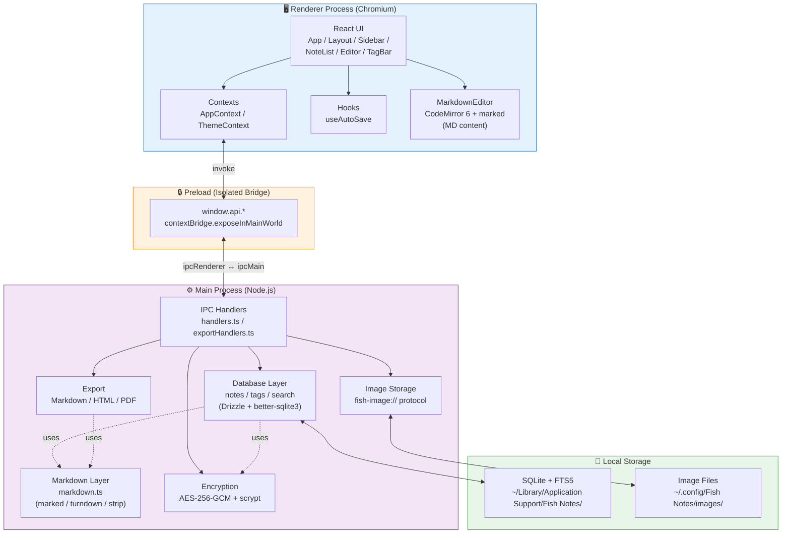
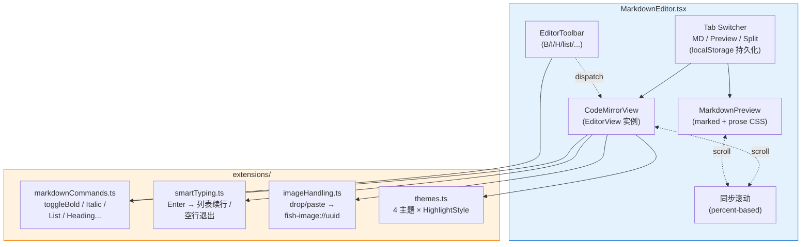
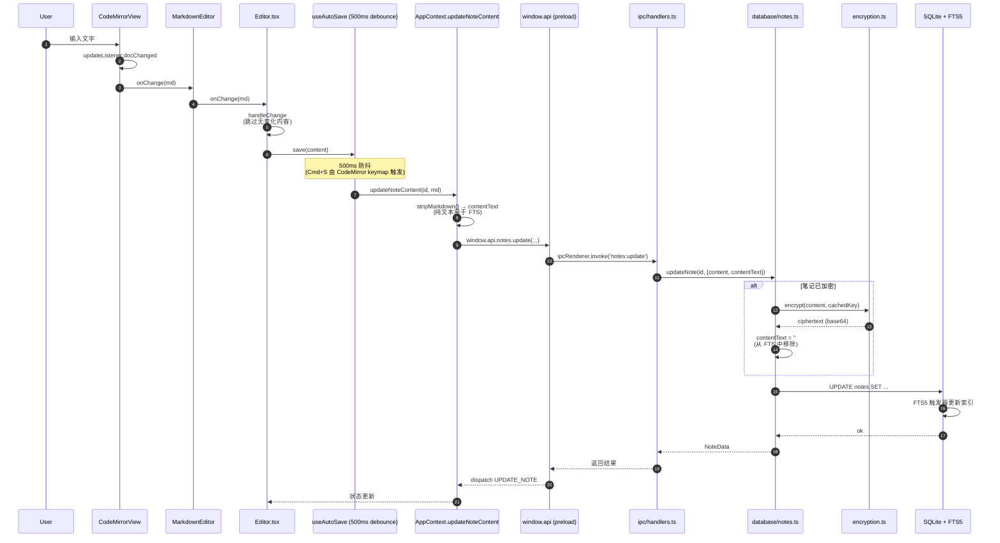
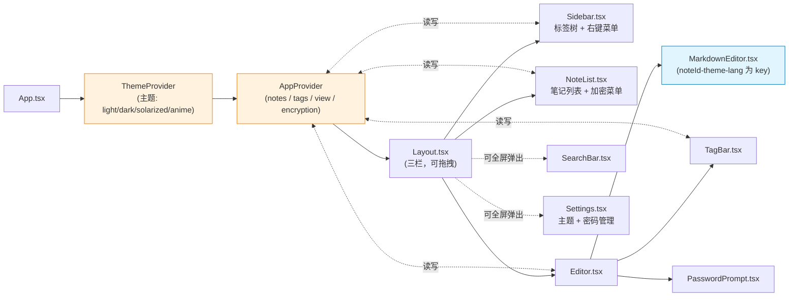

# Fish Notes Architecture

> Bear 风格本地笔记应用，基于 React + Electron + TypeScript。Markdown 是 source of truth，编辑器是 CodeMirror 6，预览渲染走 marked。
> 配合 [CLAUDE.md](./CLAUDE.md) 阅读：本文档聚焦「图示」和「数据流」，CLAUDE.md 聚焦「目录约定」和「核心机制」。

---

## 1. Electron 进程架构

三层进程隔离是 Electron 安全模型的核心。Renderer 不能直接访问文件系统或 Node API，必须通过 Preload 暴露的白名单接口与 Main 进程通信。



### 关键设计点

- **加密层（ENC）只在 Main 进程**，密钥从不进入 Renderer。
- **数据库操作全部在 Main 进程**，FTS5 全文索引和触发器都在 SQLite 层。
- **Markdown 工具集中在 `main/markdown.ts`**：被数据库迁移、解锁逻辑、导出 HTML/PDF 共享。

---

## 2. 编辑器内部结构



### 关键设计点

- **接口稳定**: `MarkdownEditor` 对外接口 `{ defaultValue, onChange }` 与原 TinyMCEEditor 一致，上层 Editor.tsx 零修改
- **快捷键和工具栏共享 command**: 两者都 dispatch `extensions/markdownCommands.ts` 里的同一组纯函数，保证行为一致
- **3 Tab + 同步滚动**: 模式持久化到 localStorage（`fish-notes:editor-mode`），Cmd+1/2/3 切换。Split 模式下基于滚动百分比同步两侧
- **主题完全重建**: 编辑器以 `noteId-theme-language` 为 React key，主题/语言切换时整个 EditorView 重建

---

## 3. 典型数据流：用户输入 → 保存到磁盘



### 关键设计点

- **Markdown 是 source of truth**: 数据库里 `content` 字段直接存 Markdown 源码（`content_format='markdown'`），不再做 HTML 中间层
- **FTS 用 stripMarkdown 后的纯文本**: 搜索时不会命中 `**` `__` 等语法字符
- **加密笔记的 content_text 被清空**: 这是加密笔记搜不到的设计原因，不是 bug
- **legacy HTML 自动转换**: 编辑器切换前已加密的笔记，解锁时 decrypt → turndown → 改写 `content_format='markdown'`，原 HTML 备份到 `content_html_legacy`

---

## 4. Renderer 组件 + Context 关系



---

## 5. AI 功能落点参考

未来添加 AI 功能时的建议落点（按"实现难度 × 用户价值"排序）：

| AI 功能 | UI 落点 | Main 进程模块 |
|---|---|---|
| AI 标题建议 | `Editor.tsx` 标题输入框旁边按钮 | `ai/titleSuggestion.ts` |
| AI 自动打标签 | `TagBar.tsx` 的 `+` 按钮旁"AI 建议"按钮 | `ai/tagSuggestion.ts` |
| AI 续写 / 重写 | CodeMirror 自定义 command + 工具栏按钮 | `ai/rewrite.ts` |
| AI Q&A (RAG) | 新建 `AskBar.tsx`，类似 SearchBar 弹窗 | `ai/embedding.ts` + `ai/qa.ts` |
| 相关笔记推荐 | `Editor.tsx` 侧栏新增 panel | `ai/similarity.ts` |
| AI 周报 / 月报 | 独立页面或 Settings 里 tab | `ai/summary.ts` |

切换到 Markdown 编辑器之后，所有 AI 功能的输入输出都是纯 Markdown，不再需要 HTML↔MD 来回转换，对 LLM API 集成、流式渲染、diff 视图都更友好。

### Main 进程建议结构

```
src/main/
├── ai/                          # 新建
│   ├── client.ts               # Anthropic/OpenAI client，密钥从 app_settings 读
│   ├── prompts.ts              # 所有 prompt 模板集中管理
│   ├── titleSuggestion.ts
│   ├── tagSuggestion.ts
│   ├── summary.ts
│   └── embedding.ts            # 做 RAG 时用
├── ipc/
│   └── aiHandlers.ts           # 新建，注册 ai:* IPC channels
```

### 关键安全约束

- **API key 存到 `app_settings` 表**（已有的加密机制可以复用），通过 Settings 页面让用户配置
- **所有 LLM 调用都在 Main 进程**，密钥绝不进 Renderer——和现有的加密 / 数据库安全模型保持一致
- **向量数据**可以用 [sqlite-vec](https://github.com/asg017/sqlite-vec) 扩展存到现有 SQLite 文件，无需引入新依赖
