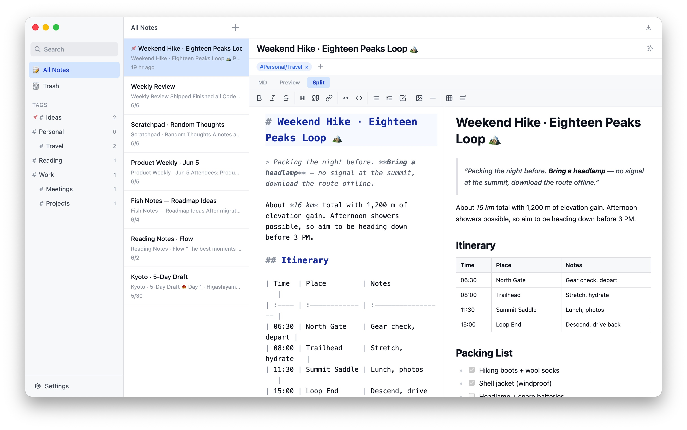
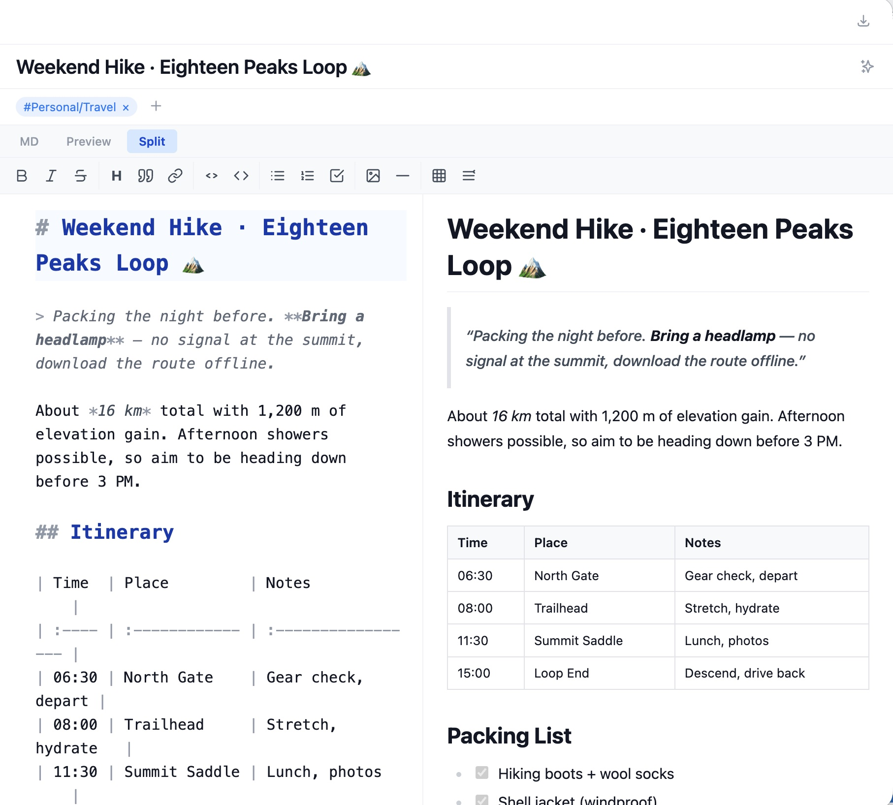
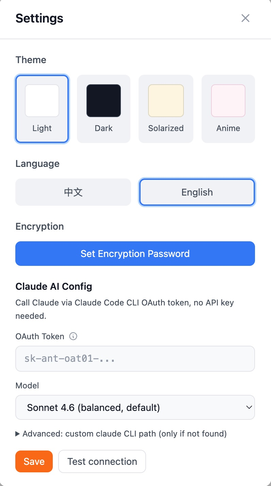

<div align="center">

# 🐟 Fish Notes

A [Bear](https://bear.app)-like desktop Markdown note-taking app · React + Electron + TypeScript

Local-first · Full-text search · End-to-end encryption · Multiple themes · Tag organization

English · [简体中文](./README.zh-CN.md)

[](https://github.com/tangqianyu/Fish-Notes/releases/latest)
[](./LICENSE)
[](https://github.com/tangqianyu/Fish-Notes/releases/latest)



</div>

## Download

Grab the installer for your platform from the **[Releases page](https://github.com/tangqianyu/Fish-Notes/releases/latest)**:

| Platform | File                            |
| -------- | ------------------------------- |
| macOS    | `.dmg` (Apple Silicon / Intel)  |
| Windows  | `Setup.exe`                     |

> The macOS build is unsigned. If you see "cannot verify the developer" on first launch, right-click the app icon and choose **Open**, or allow it under **System Settings → Privacy & Security**.

## Screenshots

|             Editor (split view)            |               Themes                |
| :----------------------------------------: | :---------------------------------: |
|   |  |

## Tech Stack

| Layer            | Choice                                              |
| ---------------- | --------------------------------------------------- |
| Desktop          | Electron 40 + Electron Forge + Vite 5               |
| Frontend         | React 18 + TypeScript 5.7                           |
| UI / Styling     | Tailwind CSS 3 + CSS Variables                      |
| Editor           | CodeMirror 6 (Markdown source + live highlighting)  |
| Preview          | marked (GFM + breaks)                               |
| Database         | better-sqlite3 + Drizzle ORM                        |
| Full-text search | SQLite FTS5                                         |
| Encryption       | AES-256-GCM + scrypt                                |
| i18n             | i18next + react-i18next                             |
| Export           | marked → HTML / direct Markdown / Electron printToPDF |
| Package manager  | yarn                                                |

## Features

### Editing

- **Markdown editor** — built on CodeMirror 6, source view with live highlighting, themed
- **3 view modes** — MD source / Preview / Split (side-by-side with synced scrolling), state persisted
- **Quick input** — toolbar + keyboard shortcuts for bold / italic / headings / quote / link / code / lists / tasks
- **Tables** — grid picker to insert aligned tables, one-click reformat to align column widths (CJK / full-width aware)
- **Smart behaviors** — list continuation, exit empty list on Enter, auto-closing brackets
- **Platform-aware** — toolbar tooltips show `⌘` (Mac) or `Ctrl+` (Win/Linux)

### Organization

- **Tags** — managed directly via the TagBar, nested tags `#parent/child`, tag tree in the sidebar
- **Full-text search** — powered by SQLite FTS5, plain-text index (Markdown syntax stripped)
- **Trash** — soft delete, restore, permanently delete
- **Pinning** — both notes and tags can be pinned

### Experience

- **Themes** — Light / Dark / Solarized / Anime
- **Multi-language** — English / Chinese
- **Auto-save** — 500ms debounce, Cmd+S to save immediately
- **Three-pane layout** — sidebar | note list | editor, with draggable widths
- **Native macOS window** — hidden title bar, integrated traffic lights
- **External links** — clicking a link in preview opens it in the system browser

### Security

- **End-to-end encryption** — note content encrypted with AES-256-GCM, key derived via scrypt
- **Session lock** — the key lives only in memory and is cleared on lock
- **Encrypted notes stay out of FTS** — not surfaced in search

### Media

- **Images** — drag-and-drop, paste, or the `` toolbar button
- **Local storage** — custom `fish-image://` protocol, UUID-named files

### Export

- **Multiple formats** — Markdown (.md) / HTML (.html) / PDF (.pdf)

## Keyboard Shortcuts

### Editor views

| Shortcut       | Action       |
| -------------- | ------------ |
| `Cmd/Ctrl + 1` | MD source    |
| `Cmd/Ctrl + 2` | Preview      |
| `Cmd/Ctrl + 3` | Split        |

### Markdown formatting

| Shortcut               | Action            |
| ---------------------- | ----------------- |
| `Cmd/Ctrl + B`         | Bold              |
| `Cmd/Ctrl + I`         | Italic            |
| `Cmd/Ctrl + Shift + S` | Strikethrough     |
| `Cmd/Ctrl + 1~6`       | Heading 1–6       |
| `Cmd/Ctrl + K`         | Link              |
| `Cmd/Ctrl + E`         | Inline code       |
| `Cmd/Ctrl + Shift + E` | Code block        |
| `Cmd/Ctrl + Shift + .` | Blockquote        |
| `Cmd/Ctrl + Shift + L` | Bullet list       |
| `Cmd/Ctrl + Shift + O` | Numbered list     |
| `Cmd/Ctrl + Shift + T` | Task list         |

### App

| Shortcut       | Action     |
| -------------- | ---------- |
| `Cmd/Ctrl + S` | Save now   |

## Development

```bash
# Install dependencies
yarn install

# Start dev mode
yarn start

# Lint
yarn run lint

# Format
yarn run format

# Type-check
npx tsc --noEmit

# Build the app
yarn make
```

## Releasing

Building and uploading are handled by GitHub Actions ([`.github/workflows/release.yml`](./.github/workflows/release.yml)): pushing a `v*` tag triggers parallel builds for macOS / Windows, and the artifacts are uploaded to the matching Release automatically.

```bash
# 1. Bump the version in package.json and commit
# 2. Tag and push
git tag v1.0.1
git push origin v1.0.1
```

A few minutes later, find the auto-generated release and installers on the [Releases page](https://github.com/tangqianyu/Fish-Notes/releases).

> macOS artifacts are not code-signed / notarized. To remove the "cannot verify the developer" prompt, configure an Apple Developer certificate and add a signing step to the workflow.

## Project Structure

```
src/
├── main.ts                              # Electron main process entry
├── preload.ts                           # IPC bridge, exposes window.api
├── main/
│   ├── database/                        # SQLite data layer (schema, CRUD, FTS5, migrations)
│   ├── ipc/                             # IPC handlers (notes/tags/search/encryption/export)
│   ├── export/                          # Export modules (Markdown/HTML/PDF)
│   ├── markdown.ts                      # Shared MD utils (marked, turndown, strip, detect)
│   ├── encryption.ts                    # AES-256-GCM + scrypt
│   └── images.ts                        # fish-image:// protocol image storage
└── renderer/
    ├── main.tsx                         # React entry
    ├── App.tsx                          # Root component + providers
    ├── index.css                        # Tailwind + CodeMirror + Markdown preview styles
    ├── components/
    │   ├── Layout.tsx                   # Three-pane layout + shortcuts
    │   ├── Sidebar.tsx                  # Sidebar (navigation + tag tree)
    │   ├── NoteList.tsx                 # Note list
    │   ├── Editor.tsx                   # Editor container + export menu
    │   ├── TagBar.tsx                   # Tag management bar
    │   ├── TitleBar.tsx                 # macOS drag region
    │   ├── SearchBar.tsx                # Full-text search popup
    │   ├── PasswordPrompt.tsx           # Password prompt
    │   ├── Settings.tsx                 # Theme + encryption settings
    │   ├── Tooltip.tsx                  # Portal-based tooltip with kbd shortcuts
    │   └── editor/
    │       ├── MarkdownEditor.tsx       # 3-tab switching entry
    │       ├── CodeMirrorView.tsx       # CodeMirror 6 wrapper
    │       ├── MarkdownPreview.tsx      # marked rendering + external links
    │       ├── EditorToolbar.tsx        # Toolbar (i18n + platform shortcuts)
    │       ├── TablePicker.tsx          # 8×8 table grid picker
    │       └── extensions/              # CodeMirror extensions (commands / smart / image / themes)
    ├── contexts/                        # React Context (AppContext, ThemeContext)
    ├── hooks/                           # Custom hooks (useAutoSave)
    ├── utils/                           # Utilities (tagParser, mdUtils)
    ├── i18n/                            # i18n config + translation files
    ├── types/                           # TypeScript type definitions
    └── styles/themes/                   # Theme CSS variables (4 themes)
```

## Database

SQLite file location: `~/Library/Application Support/Fish Notes/` (macOS)

**Four tables:**

- `notes` — id, title, content (Markdown), content_text (plain text for FTS), content_format, content_html_legacy (HTML→MD migration backup), created_at, updated_at, is_trashed, is_pinned, is_locked
- `tags` — id, name (unique), parent_id, is_pinned
- `note_tags` — note_id, tag_id (many-to-many)
- `app_settings` — key, value (password hash, salt, etc.)

Schema migrations run on startup (`database/index.ts`), including the historical md ↔ html bidirectional migration.

## License

MIT
